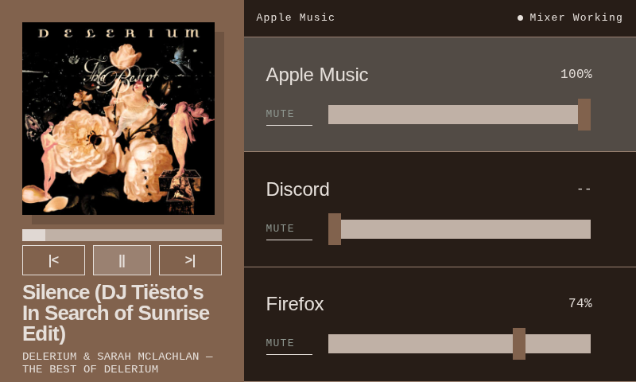
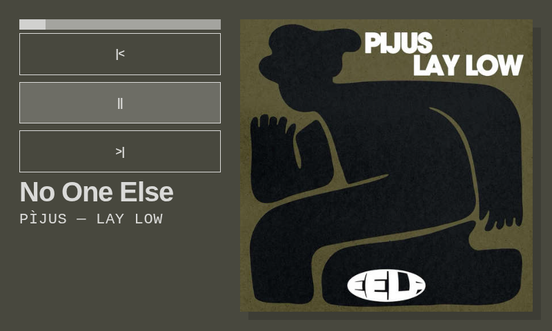

<div align="center">

# volumeMixerThing
A media control application for the BridgeThing app.

volumeMixerThing provides a clean UI for controlling application volumes and controlling currently playing media

<center>





[]()
[]()
[]()
[]()
[]()


</center>

</div>


<div align="center">

## Features
</div>

- **Audio Control:** Allows for either touchscreen or scrollable audio via selecting an application.
    - (Select App via buttons or touchscreen, then scroll to adjust volume and press to toggle mute)
- **Media Control:** Allows for media control, (play/pause, next, back) with current duration.
    - Tap album cover to toggle fullscreen and mixer view
- **Modular Application Control:** Easily add or remove wanted apps from UI using settings.
- **Background Color Control:** Easily change background color with toggle for auto.


<div align="center">

## Feature Compatibility Matrix
</div>

| Feature | Windows | macOS | Linux | Notes |
| :--- | :---: | :---: | :---: | :--- |
| BridgeThing Core | ✅ | ✅ | ✅ | Cross-platform BridgeThing engine |
| Media Playback Controls | ✅ | ✅ | ✅ |  |
|Audio Control| ✅ | ❌ | ❌ | Bridge to volume mixer |

<div align="center">

## Quick Start

</div>

**Prerequisites:**

* [Node.js](https://nodejs.org/) (v18 or higher)
* bun
* BridgeThing [BridgeThing](https://github.com/JoeyEamigh/bridgething.git)

**Installation:**

1. Clone the repository:
`git clone https://github.com/Shmankus/VolumeMixerBridgeThing.git`
or
[volumeMixerThing](https://github.com/Shmankus/VolumeMixerBridgeThing.git)

2. enter volumeMixerThing:
`cd apps/volumeMixerThing`

3. Install dependencies:
`bun install`

4. Run the main process:
`bun run build && bun run share`

5. **Then you have the zip file you can import into **BridgeThing****


<div align="center">

## App Structure
</div>

```text
volumeMixerThing/
│
├── extension/
│   ├── runtime/
│   │   ├── linux-x64/
│   │   └── win32-x64/
│   │       ├── mixer-helper.cjs
│   │       ├── mixer-worker.cjs
│   │       └── win-sound-mixer.node
│   └── main.ts
├── public/
│   └── manifest.json
├── screenshots/
├── scripts/
│   ├── bridgething.ts
│   ├── copy-native-assets.ts
│   ├── extension-runtime.ts
│   ├── push.ts
│   └── share.ts
├── settings/
│   ├── main.tsx
│   ├── settings.html
│   └── style.css
├── src/
│   ├── fonts/
│   ├── App.tsx
│   ├── daemon.ts
│   ├── index.css
│   ├── inputHandler.tsx
│   ├── main.tsx
│   ├── serverSenders.tsx
│   └── vite-env.d.ts
├── AGENTS.md
├── ARCHITECTURE.md
├── catalog.json
├── CHANGELOG.md
├── CLAUDE.md
├── index.html
├── package.json
├── tsconfig.json
├── vite.config.ts
└── vite.settings.config.ts
```

<div align="center">

## Development & Testing
</div>

BridgeThing help: [BridgeThing](https://github.com/JoeyEamigh/bridgething.git)

<div align="center">

## Develop
</div>
```sh
bun run dev            # develop the app against a connected bridgething instance
bun run dev:device     # show the dev server on the car thing screen
bun run push           # build and install to the device
bun run check          # ensure the catalog is valid
```

With more than one app in `apps/` your commands must specify which one: `bun run dev volumeMixerThing`.

Screenshot for the store listing:

```sh
bun run shot volumeMixerThing            # grabs what is on the screen
bun run shot volumeMixerThing --replace  # overwrite
```

Add another app

```sh
bun run new weather                 # a webapp
bun run new dashboard --extension   # a webapp plus a desktop-side Deno process
bun run new home --launcher         # a replacement home screen
bun run new hud --overlay           # a system overlay drawn over every webapp
```

Ship

```sh
bun run bump volumeMixerThing patch -m "Fix the wind direction arrow"
git commit -am "volumeMixerThing: fix the wind direction arrow" && git push
```

Pushing to main builds the apps and regenerates the catalog.

Agent skill

`.claude/skills/bridgething/` holds the `/bridgething` skill.

```sh
bun run skills           # refresh it from the published create-bridgething
bun run skills --check   # check whether it is behind
```

<div align="center">

##  License
</div>
This project is licensed under the MIT License - see the [LICENSE](LICENSE) file for details

